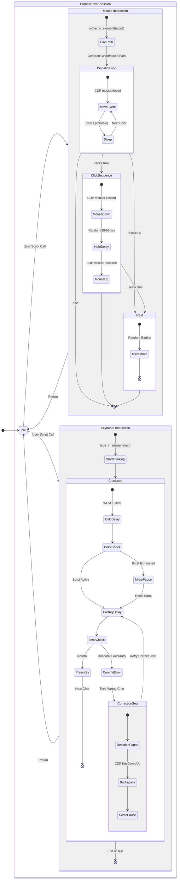

# HumanDriver Project State Diagram

```mermaid
stateDiagram-v2
    direction LR
    [*] --> Idle

    state "HumanDriver Session" as Session {
        state Idle
        
        state "Mouse Interaction" as Mouse {
            direction TB
            [*] --> PlanPath : move_to_element(target)
            PlanPath --> DispatchLoop : Generate WindMouse Path
            
            state DispatchLoop {
                [*] --> MoveEvent : CDP mouseMoved
                MoveEvent --> Sleep : ~15ms (variable)
                Sleep --> MoveEvent : Next Point
            }
            
            DispatchLoop --> ClickSequence : click=True
            DispatchLoop --> Rest : rest=True
            DispatchLoop --> [*] : else
            
            state ClickSequence {
                [*] --> MouseDown : CDP mousePressed
                MouseDown --> HoldDelay : Random(28-65ms)
                HoldDelay --> MouseUp : CDP mouseReleased
            }
            
            state Rest {
                [*] --> MicroMove : Random Radius
                MicroMove --> [*]
            }
            
            ClickSequence --> Rest : rest=True
            ClickSequence --> [*]
            Rest --> [*]
        }

        state "Keyboard Interaction" as Keyboard {
            direction TB
            [*] --> StartThinking : type_in_element(text)
            StartThinking --> CharLoop
            
            state CharLoop {
                [*] --> CalcDelay : WPM + Jitter
                CalcDelay --> BurstCheck
                
                state BurstCheck <<choice>>
                BurstCheck --> MicroPause : Burst Exhausted
                BurstCheck --> PreKeyDelay : Burst Active
                
                MicroPause --> PreKeyDelay : Reset Burst
                
                PreKeyDelay --> ErrorCheck
                
                state ErrorCheck <<choice>>
                ErrorCheck --> CommitError : Random > Accuracy
                ErrorCheck --> PressKey : Normal
                
                state CorrectionSeq {
                    [*] --> ReactionPause
                    ReactionPause --> Backspace : CDP KeyDown/Up
                    Backspace --> SettlePause
                }
                
                CommitError --> CorrectionSeq : Type Wrong Char
                CorrectionSeq --> PreKeyDelay : Retry Correct Char
                
                PressKey --> [*] : Next Char
            }
            CharLoop --> [*] : End of Text
        }
        
        Idle --> Mouse : User Script Call
        Idle --> Keyboard : User Script Call
        Mouse --> Idle : Return
        Keyboard --> Idle : Return
    }
```
